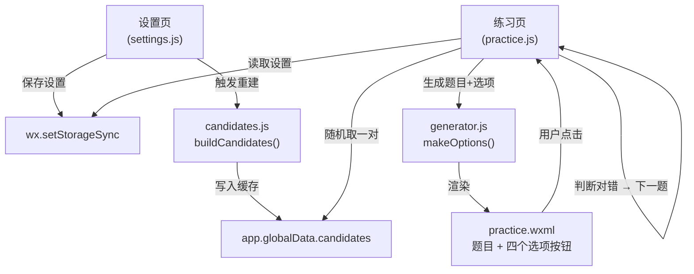

# 微信小程序心算练习 MVP 开发计划

## 目标范围

- 操作数与结果均在 `[0, 1000]`
- 四选一答题（选择题）
- 挖空位置：固定挖结果（result）
- 加减法有进退位策略（必须 / 不限）
- 乘除法无进退位策略
- 无历史记录、无签到、无多语言、无内购

---

## 文件结构

```
miniprogram/
├── app.js            # 全局初始化，读取/写入设置
├── app.json          # 页面路由：practice, settings
├── app.wxss          # 全局基础样式
├── pages/
│   ├── practice/
│   │   ├── practice.js
│   │   ├── practice.wxml
│   │   └── practice.wxss
│   └── settings/
│       ├── settings.js
│       ├── settings.wxml
│       └── settings.wxss
└── utils/
    ├── generator.js  # 题目生成（纯函数）
    └── candidates.js # 候选池构建与缓存
```

---

## 数据模型（存 `wx.setStorageSync('settings', ...)`）

```js
{
  addition: {
    enabled: true,
    level: 3,               // 1~5，决定数值范围
    useCustom: false,
    custom: { min1: 0, max1: 100, min2: 0, max2: 100 },
    carryPolicy: 'any'      // 'any' | 'must'
  },
  subtraction: {
    enabled: true,
    level: 3,
    useCustom: false,
    custom: { min1: 0, max1: 100, min2: 0, max2: 100 },
    borrowPolicy: 'any'
  },
  multiplication: {
    enabled: false,
    level: 2,
    useCustom: false,
    custom: { min1: 1, max1: 9, min2: 1, max2: 9 }
  },
  division: {
    enabled: false,
    level: 2,
    useCustom: false,
    custom: { minQ: 1, maxQ: 9, minD: 1, maxD: 9 }
  }
}
```

---

## 难度预设（`generator.js` 内常量）


| Level | 加减法 op 范围 | 乘法 op 范围      | 除法 商/除数范围         |
| ----- | --------- | ------------- | ----------------- |
| L1    | [0, 10]   | [1,5]×[1,5]   | 商[1,5], 除数[1,5]   |
| L2    | [0, 50]   | [1,9]×[1,9]   | 商[1,9], 除数[1,9]   |
| L3    | [0, 100]  | [1,9]×[1,9]   | 商[1,9], 除数[1,9]   |
| L4    | [0, 500]  | [1,20]×[1,9]  | 商[1,20], 除数[1,9]  |
| L5    | [0, 1000] | [1,20]×[1,20] | 商[1,20], 除数[1,20] |


---

## 核心逻辑

### `utils/generator.js`

- `hasCarry(a, b)` — 逐位检测加法进位
- `hasBorrow(a, b)` — 逐位检测减法退位
- `generateAddition(cfg)` / `generateSubtraction(cfg)` / `generateMultiplication(cfg)` / `generateDivision(cfg)` — 各返回 `{ op1, op2, result, operator }`，结果保证在 `[0,1000]`
- `makeOptions(correct)` — 生成 4 个选项（1 正确 + 3 干扰），干扰项在 `correct ± [1,20]` 随机偏移，去重

### `utils/candidates.js`

- `buildCandidates(cfg)` — 遍历范围，按进退位策略过滤，返回候选对数组
- `pickRandom(candidates)` — `O(1)` 随机取一对
- 候选池在**设置变更时重建**，存入 `app.globalData.candidates`（按运算类型分别缓存）

### 数据流




---

## 各页面功能

### 练习页 (`practice`)

- 顶部右上角"设置"入口（`wx.navigateTo`）
- 大字显示算式，挖空位置显示 `?`
- 四个选项按钮，点击后立即反馈（绿色/红色），200ms 后自动出下一题
- 底部显示本轮答对数 / 总答题数

### 设置页 (`settings`)

- 四种运算各自一个卡片，包含：
  - 开关（是否参与出题）
  - 难度选择 L1~L5
  - 自定义开关 + 自定义范围输入（开启时覆盖 level）
  - 加法：进位策略二选一（不限 / 必须进位）；减法：退位策略二选一（不限 / 必须退位）
- 保存时重建候选池

---

## 开发顺序

1. `app.js` + `app.json` + `app.wxss` — 项目骨架与默认设置
2. `utils/generator.js` — 纯函数，可独立测试
3. `utils/candidates.js` — 候选池构建
4. `pages/practice/` — 练习页完整交互
5. `pages/settings/` — 设置页 UI 与数据绑定
6. 打通设置 → 候选池 → 练习页数据流

